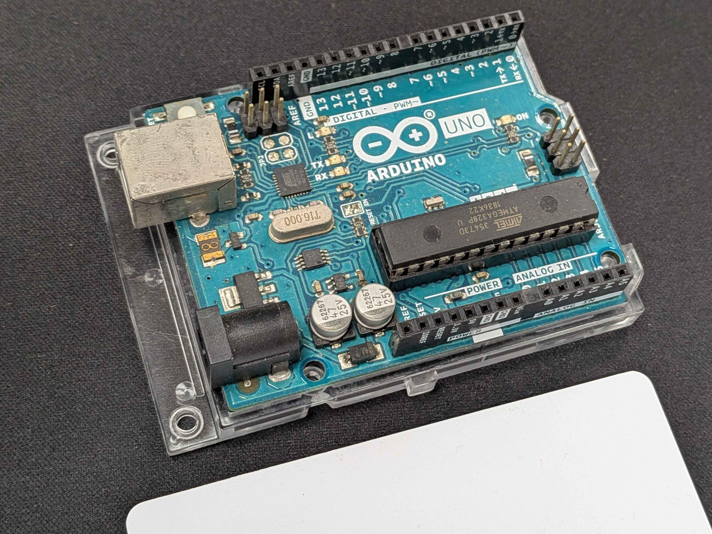

<h1 style="font-size: 5rem; font-weight: bold;">物聯網課程</h1>
<!-- <h1 style="font-size: 5rem; margin-top: 0px; font-weight: bold;">#? ???</h1> -->

---
transition: slide-left
layout: intro
color: dark
---

<h1><Link to="w1">第一周教材</Link></h1>
<h1><Link to="w2">第二周教材</Link></h1>

---
transition: slide-left
layout: top-title
color: dark
routeAlias: w1
---
::title::

<h1 style="font-size: 2.5rem; font-weight: bold;">What is IoT?</h1>

::content::

    

        

            <h2>現今是所謂「大人物」時代 
            大數據(Big Data) 
            人工智慧(Artificial Intelligence, AI) 
            物聯網(Internet of Things, IoT) 
            已經成為生活的一部份</h2> 
        

        

            
由 <a href="//commons.wikimedia.org/w/index.php?title=User:Andy_Sou&amp;action=edit&amp;redlink=1" class="new" title="User:Andy Sou (page does not exist)">Andy Sou</a> - 自己的作品, <a href="https://creativecommons.org/licenses/by-sa/4.0" title="Creative Commons Attribution-Share Alike 4.0">CC BY-SA 4.0</a>, <a href="https://commons.wikimedia.org/w/index.php?curid=85991765">連結</a>
微笑單車 (YouBike/Ubike) 就是個經典的物聯網應用

        

    

---
transition: slide-left
layout: top-title
color: dark
---
::title::

<h1 style="font-size: 2.5rem; font-weight: bold;">How it work?</h1>

::content::

    

        

            <h2>微控制器接收並分析數據再透過通訊與雲端電腦或是同系統其他裝置進行互動，藉由設定的邏輯進行後續的互動。 
            以 Ubike 悠遊卡借車為例，按鈕喚醒微控制器後更新顯示器，讀取悠遊卡 ID 並與站點資訊、車輛資訊與時間一同送到雲端系統，雲端系統判斷沒問題後控制車鎖解鎖。</h2> 
        

        

            
由 <a href="//commons.wikimedia.org/w/index.php?title=User:Rryyaann0523&amp;action=edit&amp;redlink=1" class="new" title="User:Rryyaann0523 (page does not exist)">Rryyaann0523</a> - 自己的作品, <a href="https://creativecommons.org/licenses/by-sa/4.0" title="Creative Commons Attribution-Share Alike 4.0">CC BY-SA 4.0</a>, <a href="https://commons.wikimedia.org/w/index.php?curid=128650660">連結</a>
            由 嘉義市政府, Attribution, <a href="https://commons.wikimedia.org/w/index.php?curid=112965358">連結</a>

        

    

---
transition: slide-left
layout: top-title
color: dark
---
::title::

<h1 style="font-size: 2.5rem; font-weight: bold;">MCU?</h1>

::content::

    

        

            <h2>微控制器 (Microcontroller Unit, MCU)是將輸入輸出與運算所需要的單位整合的微型電腦。 
            Arduino UNO R3 就是將微控制器與電源、針腳等整合起來，經典的開發板 (Development Board)。</h2>
            <h2 style="font-weight: bold;" v-click="1">
            什麼是微控制器?
            </h2>
            <h2 v-click="2">控制什麼? <text style="color: #00878f; background-color: #ffffff; font-weight: bold;" v-click="3">執行器 (Actuator)</text></h2>
            <h2 v-click="4">怎麼控制? <text style="color: #00878f; background-color: #ffffff; font-weight: bold;" v-click="5">程式邏輯</text></h2>
            <h2 v-click="6">怎麼互動? <text style="color: #00878f; background-color: #ffffff; font-weight: bold;" v-click="7">感測器 (Sensor)</text></h2>
        

        

            
    
            
            

                
                    Hardware
                
                
                    Arduino UNO R3
                
            

        

        

    

---
transition: slide-left
layout: top-title
color: dark
---
::title::

<h1 style="font-size: 2.5rem; font-weight: bold;">要使用開發板需要有哪些能力</h1>

::content::

    

        

            <ul style="font-size: 2rem;">
                <li>程式邏輯 (C++)</li>
                <li>基礎電路知識</li>
            </ul>
            

                <h2>BUT! 
                程式邏輯還是要有，程式能力可以藉由 Blockly (積木化程式) 克服。 
                過往需要反覆查找資料確認接線，現在也可以依靠 AI 跳過中間的過程。</h2>
            

        

        

            
        

    

---
transition: slide-left
layout: top-title
color: dark
---
::title::

<h1 style="font-size: 2.5rem; font-weight: bold;">課程中會使用的工具</h1>

::content::

    整合開發環境
    <ul>
        <li><a href="https://support.arduino.cc/hc/en-us/articles/360019833020-Download-and-install-Arduino-IDE">Arduino IDE</a></li>
    </ul>
    接線模擬
    <ul>
        <li><a href="https://wokwi.com/projects/new/arduino-nano">Wokwi</a></li>
    </ul>
    blockly 程式
    <ul>
        <li><a href="https://www.tinkercad.com/dashboard">tinkercad</a></li>
        <li><a href="https://marketplace.visualstudio.com/items?itemName=Singular-Ray.singular-blockly">Singular Blockly (in Visual Studio Code)</a></li>
    </ul>

---
transition: slide-left
layout: top-title
color: dark
routeAlias: w2
---
::title::

<h1 style="font-size: 2.5rem; font-weight: bold;">感測器</h1>

::content::

    

        

            <h2>如果把 MCU 當作大腦，感測器 (Sensor) 就等同於受器。 
            常見的感測器有：按鈕開關、可變電阻、RFID 讀取器、紅外線接收器、人體紅外線感測器、超音波感測器、聲音感測器等、三軸感測器、雙軸按鍵搖桿...... 
            </h2>
        

        

            
            搖桿是融合許多感測器的經典例子
        

    

---
transition: slide-left
layout: top-title
color: dark
---

::title::

<h1 style="font-size: 2.5rem; font-weight: bold;">感測器介紹——RFID 讀取器</h1>

::content::

    

        

            <h2>RFID 讀取器是透過發射無線電波，激活要讀取的標籤並接收標籤回傳的資料，標籤內的資料則通常以一個微小的晶片儲存。 
            RFID 掃描距離視不同的讀取器與標籤組合而定，被動式標籤最長距離可到十公尺左右 (超高頻 RFID)。 
            RFID 常見的用法是利用標籤的不同 ID 區分不同人、車，如悠遊卡與 e-tag。 
            也能用來判斷是否有目標經過，如防盜門。</h2>
        

        

            
        

    

---
transition: slide-left
layout: top-title
color: dark
---

::title::

<h1 style="font-size: 2.5rem; font-weight: bold;">感測器介紹——超音波感測器</h1>

::content::

    

        

            <h2>超音波感測器是透過聲波發射到收到回彈聲波的時間差估算距離。 
            超音波感測器常見的用法是透過多方向的反覆偵測距離，描繪出特定方向的障礙物/牆面輪廓，如聲納。 
            也能利用偵測到的不同距離，做出示警，如倒車雷達。</h2>
        

        

            
        

    

---
transition: slide-left
layout: top-title
color: dark
---

::title::

<h1 style="font-size: 2.5rem; font-weight: bold;">超音波感測器實驗</h1>

::content::

    

        

            <h2>
            使用超音波感測器與單色 LED 模擬倒車雷達運作
            </h2>
             
            

                <h2>
                # 本日作業 
                要求： 
                持續(delay(50);)輸出距離(公分) 
                綠燈在20公分以上長亮 
                黃燈在10~20公分間長亮 
                紅燈在10公分內快速閃爍 (建議delay(); > 100ms) 
                作業要求： 
                繳交 wokwi 的 project.zip & 現場檢查運作
                </h2>
            

        

        

            
        

    

