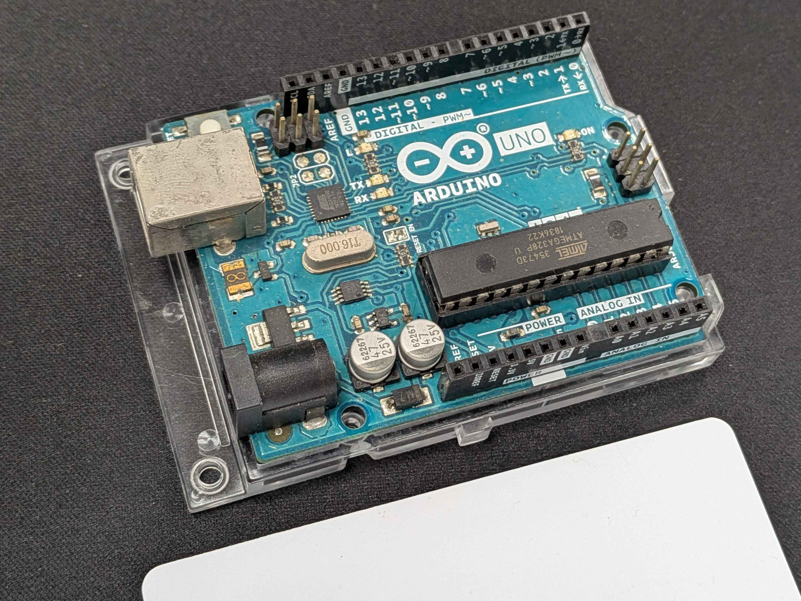
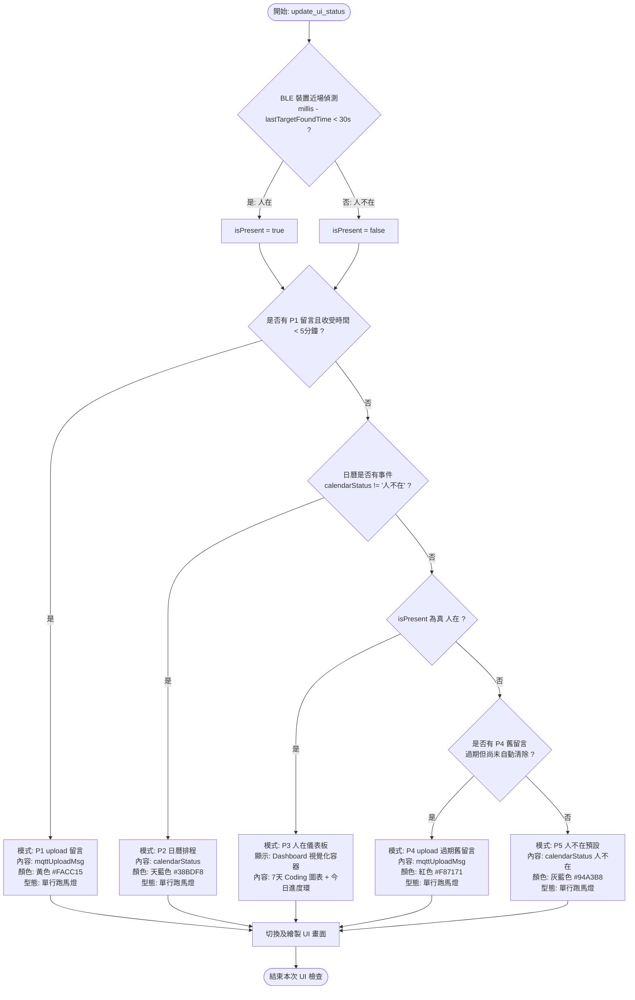

<h1 style="font-size: 5rem; font-weight: bold;">物聯網課程</h1>


---
transition: slide-left
layout: intro
color: dark
routeAlias: Outline
---

<h1><Link to="w1">第一周教材</Link></h1>
<h1><Link to="w2">第二周教材</Link></h1>
<h1><Link to="w3">第三周教材</Link></h1>
<h1><Link to="w4">第四周教材</Link></h1>
<h1><Link to="w5">第五周教材</Link></h1>
<h1><Link to="w6">第六周教材</Link></h1>

---
transition: slide-left
layout: top-title
color: dark
routeAlias: w1
---
::title::

<h1 style="font-size: 2.5rem; font-weight: bold;">What is IoT?</h1>

::content::
<div style="margin-bottom: 10px;">
    <div style="width: 100%; display: flex; align-items: flex-start; box-sizing: border-box;">
        <div style="width: 66%; padding-right: 20px; box-sizing: border-box;">
            <h2>現今是所謂「大人物」時代<br>
            <span style="background:#FFE45E; color:black;">大</span>數據(Big Data)<br>
            <span style="background:#FFE45E; color:black;">人</span>工智慧(Artificial Intelligence, AI)<br>
            <span style="background:#FFE45E; color:black;">物</span>聯網(Internet of Things, IoT)<br>
            已經成為生活的一部份</h2> 
        </div>
        <div style="width: 34%; display: flex; flex-direction: column; align-items: center; text-align: center; box-sizing: border-box;">
            <p><a href="https://commons.wikimedia.org/wiki/File:YouBike_2.0.jpg#/media/File:YouBike_2.0.jpg"></a><span style="font-size: 0.8rem;">由 <a href="//commons.wikimedia.org/w/index.php?title=User:Andy_Sou&amp;action=edit&amp;redlink=1" class="new" title="User:Andy Sou (page does not exist)">Andy Sou</a> - <span class="int-own-work" lang="zh-tw">自己的作品</span>, <a href="https://creativecommons.org/licenses/by-sa/4.0" title="Creative Commons Attribution-Share Alike 4.0">CC BY-SA 4.0</a>, <a href="https://commons.wikimedia.org/w/index.php?curid=85991765">連結</a></span><p>微笑單車 (YouBike/Ubike) 就是個經典的物聯網應用</p></p>
        </div>
    </div>
</div>

---
transition: slide-left
layout: top-title
color: dark
---
::title::

<h1 style="font-size: 2.5rem; font-weight: bold;">How it work?</h1>

::content::
<div style="margin-bottom: 10px;">
    <div style="width: 100%; display: flex; align-items: flex-start; box-sizing: border-box;">
        <div style="width: 66%; padding-right: 20px; box-sizing: border-box;">
            <h2><span style="background:#FFE45E; color:black;">微控制器</span>接收並分析數據再透過通訊與雲端電腦或是同系統其他裝置進行互動，藉由設定的邏輯進行後續的互動。<br>
            以 Ubike 悠遊卡借車為例，按鈕喚醒微控制器後更新顯示器，讀取悠遊卡 ID 並與站點資訊、車輛資訊與時間一同送到雲端系統，雲端系統判斷沒問題後控制車鎖解鎖。</h2> 
        </div>
        <div style="width: 34%; display: flex; flex-direction: column; align-items: center; text-align: center; box-sizing: border-box;">
            <p><a href="https://commons.wikimedia.org/wiki/File:Youbike_2.0%E8%BB%8A%E6%A9%9F.jpg#/media/File:Youbike_2.0%E8%BB%8A%E6%A9%9F.jpg"></a><span style="font-size: 0.8rem;">由 <a href="//commons.wikimedia.org/w/index.php?title=User:Rryyaann0523&amp;action=edit&amp;redlink=1" class="new" title="User:Rryyaann0523 (page does not exist)">Rryyaann0523</a> - <span class="int-own-work" lang="zh-tw">自己的作品</span>, <a href="https://creativecommons.org/licenses/by-sa/4.0" title="Creative Commons Attribution-Share Alike 4.0">CC BY-SA 4.0</a>, <a href="https://commons.wikimedia.org/w/index.php?curid=128650660">連結</a></span>
            <a href="https://commons.wikimedia.org/wiki/File:YouBike_2.0E_display.jpg#/media/File:YouBike_2.0E_display.jpg"></a><span style="font-size: 0.8rem;">由 嘉義市政府, Attribution, <a href="https://commons.wikimedia.org/w/index.php?curid=112965358">連結</a></span></p>
        </div>
    </div>
</div>

---
transition: slide-left
layout: top-title
color: dark
---
::title::

<h1 style="font-size: 2.5rem; font-weight: bold;">MCU?</h1>

::content::
<div style="margin-bottom: 10px;">
    <div style="width: 100%; display: flex; align-items: flex-start; box-sizing: border-box;">
        <div style="width: 66%; padding-right: 20px; box-sizing: border-box;">
            <h2><span style="background:#FFE45E; color:black;">微控制器 (Microcontroller Unit, MCU)</span>是將輸入輸出與運算所需要的單位整合的<span style="background:#FFE45E; color:black;">微型電腦。</span><br>
            Arduino UNO R3 就是將微控制器與電源、針腳等整合起來，經典的<span style="background:#FFE45E; color:black;">開發板 (Development Board)</span>。</h2>
            <h2 style="font-weight: bold;" v-click="1">
            什麼是微控制器?
            </h2>
            <h2 v-click="2">控制什麼? <text style="color: #00878f; background-color: #ffffff; font-weight: bold;" v-click="3">執行器 (Actuator)</text></h2>
            <h2 v-click="4">怎麼控制? <text style="color: #00878f; background-color: #ffffff; font-weight: bold;" v-click="5">程式邏輯</text></h2>
            <h2 v-click="6">怎麼互動? <text style="color: #00878f; background-color: #ffffff; font-weight: bold;" v-click="7">感測器 (Sensor)</text></h2>
        </div>
        <div style="width: 34%; display: flex; flex-direction: column; align-items: center; text-align: center; box-sizing: border-box;">
            <div style="width: 100%; border-radius: 12px; box-shadow: 0 10px 25px rgba(0,0,0,0.3); overflow: hidden; background: #1e293b;">    
            
            <div class="flex items-center justify-center gap-3 py-4">
                <span class="text-[10px] font-bold text-white bg-[#00878f] px-2 py-1 rounded uppercase tracking-wider">
                    Hardware
                </span>
                <span class="text-sm font-semibold text-gray-300 tracking-wide">
                    Arduino UNO R3
                </span>
            </div>
        </div>
        </div>
    </div>
</div>

---
transition: slide-left
layout: top-title
color: dark
---
::title::

<h1 style="font-size: 2.5rem; font-weight: bold;">要使用開發板需要有哪些能力</h1>

::content::

<div style="margin-bottom: 10px;">
    <div style="width: 100%; display: flex; align-items: flex-start; box-sizing: border-box;">
        <div style="width: 66%; padding-right: 20px; box-sizing: border-box;">
            <ul style="font-size: 2rem;">
                <li>程式邏輯 (C++)</li>
                <li>基礎電路知識</li>
            </ul>
            <div v-click="1">
                <h2>BUT!<br>
                程式邏輯還是要有，程式能力可以藉由 Blockly (積木化程式) 克服。<br>
                過往需要反覆查找資料確認接線，現在也可以依靠 AI 跳過中間的過程。</h2>
            </div>
        </div>
        <div style="width: 34%; display: flex; flex-direction: column; align-items: center; text-align: center; box-sizing: border-box;">
            
        </div>
    </div>
</div>

---
transition: slide-left
layout: top-title
color: dark
---
::title::

<h1 style="font-size: 2.5rem; font-weight: bold;">課程中會使用的工具</h1>

::content::

<div style="font-size: 1.8rem">
    整合開發環境
    <ul>
        <li><a href="https://support.arduino.cc/hc/en-us/articles/360019833020-Download-and-install-Arduino-IDE">Arduino IDE</a></li>
    </ul>
    接線模擬
    <ul>
        <li><a href="https://wokwi.com/projects/new/arduino-nano">Wokwi</a></li>
    </ul>
    blockly 程式
    <ul>
        <li><a href="https://www.tinkercad.com/dashboard">tinkercad</a></li>
        <li><a href="https://marketplace.visualstudio.com/items?itemName=Singular-Ray.singular-blockly">Singular Blockly (in Visual Studio Code)</a></li>
    </ul>
</div>

---
transition: slide-left
layout: top-title
color: dark
routeAlias: w2
---
::title::

<h1 style="font-size: 2.5rem; font-weight: bold;">感測器</h1>

::content::

<div style="margin-bottom: 10px;">
    <div style="width: 100%; display: flex; align-items: flex-start; box-sizing: border-box;">
        <div style="width: 66%; padding-right: 20px; box-sizing: border-box;">
            <h2>如果把 <span style="background:#FFE45E; color:black;">MCU 當作大腦</span>，感測器 (Sensor) 就等同於<span style="background:#FFE45E; color:black;">受器</span>。<br>
            常見的感測器有：按鈕開關、可變電阻、RFID 讀取器、紅外線接收器、人體紅外線感測器、超音波感測器、聲音感測器等、三軸感測器、雙軸按鍵搖桿......<br>
            </h2>
        </div>
        <div style="width: 34%; display: flex; flex-direction: column; align-items: center; text-align: center; box-sizing: border-box;">
            
            搖桿是融合許多感測器的經典例子
        </div>
    </div>
</div>

---
transition: slide-left
layout: top-title
color: dark
---
::title::

<h1 style="font-size: 2.5rem; font-weight: bold;">感測器的作用</h1>

::content::

<div style="margin-bottom: 10px;">
    <div style="width: 100%; display: flex; align-items: flex-start; box-sizing: border-box;">
        <div style="width: 66%; padding-right: 20px; box-sizing: border-box;">
            <h2>感測器在一個裝置中通常會利用電位差、計時器等，<span style="background:#FFE45E; color:black;">給予微控制器不同的數值</span>，微控制器再根據不同的數值進行對應的行為。<br>
            現今的開發板會有<span style="background:#FFE45E; color:black;">針對不同 Sensor 的專屬程式/函式庫 (Library)</span>，函式庫會根據 Sensor 的特性，<span style="background:#FFE45E; color:black;">使讀取到的數值變成通用的數值單位</span>或是使控制變簡單。
            </h2>
        </div>
        <div style="width: 34%; display: flex; flex-direction: column; align-items: center; text-align: center; box-sizing: border-box;">
            
        </div>
    </div>
</div>

---
transition: slide-left
layout: top-title
color: dark
---

::title::

<h1 style="font-size: 2.5rem; font-weight: bold;">感測器介紹——RFID 讀取器</h1>

::content::

<div style="margin-bottom: 10px;">
    <div style="width: 100%; display: flex; align-items: flex-start; box-sizing: border-box;">
        <div style="width: 66%; padding-right: 20px; box-sizing: border-box;">
            <h2>RFID 讀取器是透過發射<span style="background:#FFE45E; color:black;">無線電波</span>，激活要讀取的(無源)標籤並<span style="background:#FFE45E; color:black;">接收標籤回傳的資料</span>，標籤內的<span style="background:#FFE45E; color:black;">資料則通常以一個微小的晶片儲存</span>。<br>
            RFID 掃描距離視不同的讀取器與標籤組合而定，被動式標籤最長距離可到十公尺左右 (超高頻 RFID)。<br>
            RFID 常見的用法是<span style="background:#FFE45E; color:black;">利用標籤的不同 ID 區分</span>不同人、車，如悠遊卡與 e-tag。<br>
            也能用來<span style="background:#FFE45E; color:black;">判斷是否有目標經過/靠近</span>，如防盜門。</h2>
        </div>
        <div style="width: 34%; display: flex; flex-direction: column; align-items: center; text-align: center; box-sizing: border-box;">
            
        </div>
    </div>
</div>

---
transition: slide-left
layout: top-title
color: dark
---

::title::

<h1 style="font-size: 2.5rem; font-weight: bold;">感測器介紹——超音波感測器</h1>

::content::

<div style="margin-bottom: 10px;">
    <div style="width: 100%; display: flex; align-items: flex-start; box-sizing: border-box;">
        <div style="width: 66%; padding-right: 20px; box-sizing: border-box;">
            <h2>超音波感測器是透過<span style="background:#FFE45E; color:black;">發射聲波和接收回彈聲波的時間差估算距離</span>。<br>
            超音波感測器常見的用法是透過多方向的反覆偵測距離，<span style="background:#FFE45E; color:black;">描繪出特定方向的障礙物/牆面輪廓</span>，如聲納。<br>
            也能利用偵測到的距離變化，做出示警，如倒車雷達。</h2>
        </div>
        <div style="width: 34%; display: flex; flex-direction: column; align-items: center; text-align: center; box-sizing: border-box;">
            
        </div>
    </div>
</div>

---
transition: slide-left
layout: top-title
color: dark
---

::title::

<h1 style="font-size: 2.5rem; font-weight: bold;">超音波感測器實驗</h1>

::content::

<div style="margin-bottom: 10px;">
    <div style="width: 100%; display: flex; align-items: flex-start; box-sizing: border-box;">
        <div style="width: 66%; padding-right: 20px; box-sizing: border-box;">
            <h2>
            使用超音波感測器與一顆單色 LED 模擬倒車雷達運作<br><br>
            要求：<br>
            LED燈在10公分內閃爍 <span style="background:#FFE45E; color:black;">(delay(200);)</span><br>
            LED燈在10~30公分間閃爍更慢 <span style="background:#FFE45E; color:black;">(delay(400);)</span><br>
            LED燈在30公分以上時不亮
            </h2>
        </div>
        <div style="width: 34%; display: flex; flex-direction: column; align-items: center; text-align: center; box-sizing: border-box;">
            
        </div>
    </div>
</div>

---
transition: slide-left
layout: top-title
color: dark
routeAlias: w3
---
::title::

<h1 style="font-size: 2.5rem; font-weight: bold;">執行器</h1>

::content::

<div style="margin-bottom: 10px;">
    <div style="width: 100%; display: flex; align-items: flex-start; box-sizing: border-box;">
        <div style="width: 66%; padding-right: 20px; box-sizing: border-box;">
            <h2>如果把 <span style="background:#FFE45E; color:black;">MCU 當作大腦</span>，感測器 (Actuator) 就等同於<span style="background:#FFE45E; color:black;">動器</span>。<br>
            常見的執行器有：LED、燈泡、蜂鳴器、喇叭、電磁閥、馬達......<br>
            </h2>
        </div>
        <div style="width: 34%; display: flex; flex-direction: column; align-items: center; text-align: center; box-sizing: border-box;">
            
            送餐機器人是融合許多執行器例子
        </div>
    </div>
</div>

---
transition: slide-left
layout: top-title
color: dark
---

::title::

<h1 style="font-size: 2.5rem; font-weight: bold;">超音波感測器實作作業</h1>

::content::

<h2>
# 本日作業<br>
要求：<br>
綠燈在30公分以上長亮<br>
黃燈在10~30公分間快速閃爍(delay(300);)<br>
紅燈在10公分內快速閃爍 <span style="background:#FFE45E; color:black;">(delay(150);)</span><br>
作業要求：<br>
接線：繳交 <span style="background:#FFE45E; color:black;">wokwi 的 diagram.json</span> (於下載的 project.zip 中)<br>
程式：本次作業燒錄(上傳)的<span style="background:#FFE45E; color:black;">程式檔</span> (*使用 Arduino IDE 燒錄的為 .ino 檔，使用 Singular Blockly 燒錄的為 main.cpp 檔)<br>
運作：<span style="background:#FFE45E; color:black;">現場檢查</span>運作<br><br>
詳見 Classroom 中作業說明
</h2>

---
transition: slide-left
layout: top-title
color: dark
routeAlias: w4
---

::title::

<h1 style="font-size: 2.5rem; font-weight: bold;">顯示器</h1>

::content::

<div style="margin-bottom: 10px;">
    <div style="width: 100%; display: flex; align-items: flex-start; box-sizing: border-box;">
        <div style="width: 66%; padding-right: 20px; box-sizing: border-box;">
            <h2>顯示器是生活中常見的輸出裝置，在物聯網應用中，常用於呈現雲端資訊或感測器數據。然而，由於微控制器本身的<span style="background:#FFE45E; color:black;">記憶體與運算資源有限</span>，通常難以甚至無法渲染高解析度的複雜畫面。因此，實務上常需要藉由電腦等設備協助處理，或是盡可能簡化畫面內容並減少細節，才能將資訊順利顯示。
            </h2>
        </div>
        <div style="width: 34%; display: flex; flex-direction: column; align-items: center; text-align: center; box-sizing: border-box;">
            
            電視就屬於顯示器的一種
        </div>
    </div>
</div>

---
transition: slide-left
layout: top-title
color: dark
---

::title::

<h1 style="font-size: 2.5rem; font-weight: bold;">1602LCD 實作</h1>

::content::

<div style="margin-bottom: 10px;">
    <div style="width: 100%; display: flex; align-items: flex-start; box-sizing: border-box;">
        <div style="width: 66%; padding-right: 20px; box-sizing: border-box;">
            <h2>
            使用 library: LiquidCrystal I2C<br>
            </h2>
        </div>
        <div style="width: 34%; display: flex; flex-direction: column; align-items: center; text-align: center; box-sizing: border-box;">
            
        </div>
    </div>
</div>

---
transition: slide-left
layout: top-title
color: dark
---

::title::

<h1 style="font-size: 2.5rem; font-weight: bold;">"Internet" of Things</h1>

::content::

<div style="margin-bottom: 10px;">
    <div style="width: 100%; display: flex; align-items: flex-start; box-sizing: border-box;">
        <div style="width: 66%; padding-right: 20px; box-sizing: border-box;">
            <h2><span style="background:#FFE45E; color:black;">網際網路 (Internet)</span> 是現代資訊傳遞與裝置連線的核心基石。在物聯網的應用場景中，為了讓感測器、微控制器與雲端平台能夠順暢溝通，發展出了多種<span style="background:#FFE45E; color:black;">專門的通訊協定與模式</span>，如藍芽、Wi-Fi 與 MQTT。其中，Wi-Fi 是建立網路連線的關鍵技術；而 MQTT 則是依靠網路連線，作為訊息傳輸的應用協定。
            </h2>
        </div>
        <div style="width: 34%; display: flex; flex-direction: column; align-items: center; text-align: center; box-sizing: border-box;">
            
            Wi-Fi 已是生活不可或缺的一部份
        </div>
    </div>
</div>

---
transition: slide-left
layout: top-title
color: dark
---

::title::

<h1 style="font-size: 2.5rem; font-weight: bold;">SoftAP + 1602LCD 實作作業</h1>

::content::

<div style="margin-bottom: 10px;">
    <div style="width: 100%; display: flex; align-items: flex-start; box-sizing: border-box;">
        <div style="width: 66%; padding-right: 20px; box-sizing: border-box;">
            <h2>
            # 本日作業<br>
            要求：<br>
            1.<span style="background:#FFE45E; color:black;">修改</span>範例程式並燒錄進 Nano 33 IoT 中<br>
            2.連線網路並進入 1602 LCD 顯示的 ip <br>
            3.輸入座號與<span style="background:#FFE45E; color:black;">Happy Moon festival!</span><br><br>
            繳交要求與配分：<br>
            <span style="background:#FFE45E; color:black;">diagram.json</span> (30%)<br>
            程式檔 (.ino檔) (30%)<br>
            送出訊息後的手機截圖 (20%)<br>
            LCD 執行結果 照片(20%)<br>
            </h2>
        </div>
        <div style="width: 34%; display: flex; flex-direction: column; align-items: start; text-align: start; box-sizing: border-box;">
            範例程式：<br>

```cpp
#include <SPI.h>
#include <WiFiNINA.h>
#include <Wire.h>
#include <LiquidCrystal_I2C.h>

char ssid[] = "兩人班級座號 e.g:201**201**";
char pass[] = "半形英數 >= 8 位";
int status = WL_IDLE_STATUS;

WiFiServer server(80);
LiquidCrystal_I2C lcd(0x27, 16, 2);

String currentLine = "";
String seats = "Seat No.";
String message = "No Msg";

String urlDecode(String input) {
    String decoded = "";
    char c;
    for (unsigned int i = 0; i < input.length(); i++) {
        c = input.charAt(i);
        if (c == '+') {
            decoded += ' ';
        } else if (c == '%' && i + 2 < input.length()) {
            char hex1 = input.charAt(i + 1);
            char hex2 = input.charAt(i + 2);
            int value = 0;
            if (hex1 >= '0' && hex1 <= '9') value += (hex1 - '0') * 16;
            else if (hex1 >= 'A' && hex1 <= 'F') value += (hex1 - 'A' + 10) * 16;
            else if (hex1 >= 'a' && hex1 <= 'f') value += (hex1 - 'a' + 10) * 16;

            if (hex2 >= '0' && hex2 <= '9') value += (hex2 - '0');
            else if (hex2 >= 'A' && hex2 <= 'F') value += (hex2 - 'A' + 10);
            else if (hex2 >= 'a' && hex2 <= 'f') value += (hex2 - 'a' + 10);

            decoded += (char)value;
            i += 2;
        } else {
            decoded += c;
        }
    }
    return decoded;
}

void updateLCD() {
    lcd.clear();

    String fullText = seats + " " + message;

    String line1 = "";
    if (fullText.length() > 0) {
        line1 = fullText.substring(0, min((int)fullText.length(), 16));
    }

    String line2 = "";
    if (fullText.length() > 16) {
        line2 = fullText.substring(16, min((int)fullText.length(), 32));
    }

    lcd.setCursor(0, 0);
    lcd.print(line1);

    if (line2.length() > 0) {
        lcd.setCursor(0, 1);
        lcd.print(line2);
    }
}

void setup() {
    Wire.begin();
    lcd.init();
    lcd.backlight();
    lcd.setCursor(0, 0);
    lcd.print("Starting AP...");

    if (WiFi.status() == WL_NO_MODULE) {
        lcd.clear();
        lcd.print("WiFi Mod Failed");
        while (true);
    }

    status = WiFi.beginAP(ssid, pass);
    if (status != WL_AP_LISTENING) {
        lcd.clear();
        lcd.print("AP Start Failed");
        while (true);
    }

    delay(10000);
    server.begin();

    updateLCD();
}

void loop() {
    WiFiClient client = server.available();

    if (client) {
        currentLine = "";
        while (client.connected()) {
            if (client.available()) {
                char c = client.read();
                if (c == '\n') {
                    if (currentLine.length() == 0) {
                        client.println("HTTP/1.1 200 OK");
                        client.println("Content-Type: text/html");
                        client.println("Connection: close");
                        client.println();
                        client.println("<!DOCTYPE HTML>");
                        client.println("<html>");
                        client.println("<head><meta name=\"viewport\" content=\"width=device-width, initial-scale=1\"></head>");
                        client.println("<body><h1>Nano 33 IoT Controller</h1>");
                        client.println("<p>Current Seats: " + seats + "</p>");
                        client.println("<p>Current Message: " + message + "</p>");
                        client.println("<form action=\"/submit\" method=\"GET\">");
                        client.println("Seats (e.g. 10 11): <input type=\"text\" name=\"seats\" value=\"" + seats + "\"><br><br>");
                        client.println("Message: <input type=\"text\" name=\"msg\" value=\"" + message + "\"><br><br>");
                        client.println("<input type=\"submit\" value=\"Send\">");
                        client.println("</form>");
                        client.println("</body></html>");
                        break;
                    } else {
                        if (currentLine.startsWith("GET /submit?")) {
                            int seatsParam = currentLine.indexOf("seats=");
                            int msgParam = currentLine.indexOf("&msg=");
                            int endIdx = currentLine.indexOf(" HTTP/");

                            if (seatsParam != -1 && msgParam != -1 && endIdx != -1) {
                                String rawSeats = currentLine.substring(seatsParam + 6, msgParam);
                                String rawMsg = currentLine.substring(msgParam + 5, endIdx);

                                seats = urlDecode(rawSeats);
                                message = urlDecode(rawMsg);

                                updateLCD();
                            }
                        }
                        currentLine = "";
                    }
                } else if (c != '\r') {
                    currentLine += c;
                }
            }
        }
        delay(1);
        client.stop();
    }
}
```

</div>
    </div>
</div>


---
transition: slide-left
layout: top-title
color: dark
---

::title::

<h1 style="font-size: 2.5rem; font-weight: bold;">補充：網頁 html 碼</h1>

::content::

```html
<!DOCTYPE HTML>
<html>
<head>
    <meta name="viewport" content="width=device-width, initial-scale=1">
    <title>Nano 33 IoT Controller</title>
</head>
<body>
    <h1>Nano 33 IoT Controller</h1>
    
    <p>Current Seats: Seat No.</p>
    <p>Current Message: No Msg</p>
    
    <form action="/submit" method="GET">
        Seats (e.g. 10 11): <input type="text" name="seats" value="Seat No."><br><br>
        Message: <input type="text" name="msg" value="No Msg"><br><br>
        <input type="submit" value="Send">
    </form>
</body>
</html>
```


---
transition: slide-left
layout: top-title
color: dark
routeAlias: w5
---

::title::

<h1 style="font-size: 2.5rem; font-weight: bold;">MQTT</h1>

::content::

<div style="margin-bottom: 10px;">
    <div style="width: 100%; display: flex; align-items: flex-start; box-sizing: border-box;">
        <div style="width: 50%; padding-right: 20px; box-sizing: border-box;">
            <h2>相較於 <span style="background:#FFE45E; color:black;">AP (Access Point)</span> 模式，<span style="background:#FFE45E; color:black;">STA (Station)</span> 模式更常用於物聯網裝置，主因是它能讓裝置連線至區域網路與網際網路，進而實現雲端資料同步與遠端遙控。<br>而在 STA 模式下，MQTT 是最常使用的通訊協定，其<span style="background:#FFE45E; color:black;">極輕量化的訊息標頭</span>特別適合頻寬有限或網路環境較差的物聯網場景。
            </h2>
        </div>
        <div style="width: 50%; display: flex; flex-direction: column; align-items: center; text-align: center; box-sizing: border-box;">
            
            物聯「網」
        </div>
    </div>
</div>

---
transition: slide-left
layout: top-title
color: dark
---

::title::

<h1 style="font-size: 2.5rem; font-weight: bold;">MQTT 原理</h1>

::content::

<div style="margin-bottom: 10px;">
    <div style="width: 100%; display: flex; align-items: flex-start; box-sizing: border-box;">
        <div style="width: 60%; padding-right: 20px; box-sizing: border-box;">
            <h2>MQTT 結構較為特殊，以 Broker (代理伺服器) 為核心，<span style="background:#FFE45E; color:black;">透過「發布/訂閱」機制進行訊息調度</span>。使用者可對特定的 Topic (主題) 進行 Publish (發布) 或 Subscribe (訂閱)。
            由於 Topic 支援多層級結構，物聯網架構常藉此將不同區域、感測器種類與應用情境進行清晰劃分與管理。
            </h2>
            <p v-click="1"><a href="https://jetsion.com/dashboard.html">捷上科技儀表板</a></p>
        </div>
        <div style="width: 40%; display: flex; flex-direction: column; align-items: center; text-align: center; box-sizing: border-box;">
            
            Broker 是 MQTT 的核心
        </div>
    </div>
</div>


---
transition: slide-left
layout: top-title
color: dark
routeAlias: w6
---

::title::

<h1 style="font-size: 2.5rem; font-weight: bold;">Side Project 解說 (Ⅰ)</h1>

::content::

<div style="margin-bottom: 10px;">
    <div style="width: 100%; display: flex; align-items: flex-start; box-sizing: border-box;">
        <div style="width: 60%; padding-right: 20px; box-sizing: border-box;">
            <h2>Side Project (個人專案) 發想</h2>
            <h2 v-click="1">1. 觀察生活、找出問題、拆解問題</h2>
            <h2 v-click="2">e.g. 當我想要在桌上有個 <span style="background:#FFE45E; color:black;">TODO list 或是 dashboard (儀錶板)</span>，同時也想要有個能夠當我不在座位時，來到我座位的人<span style="background:#FFE45E; color:black;">能知道我可能在哪</span>
            </h2>
            <h2 v-click="3">標起來的都需要一個螢幕 (顯示器)<br><span  v-click="4">也需要知道我人在不在座位</span><br><span style="background:#FFE45E; color:black;" v-click="5">But HOW?</span></h2>
        </div>
        <div style="width: 40%; display: flex; flex-direction: column; align-items: center; text-align: center; box-sizing: border-box;">
            
        </div>
    </div>
</div>


---
transition: slide-left
layout: top-title
color: dark
---

::title::

<h1 style="font-size: 2.5rem; font-weight: bold;">Side Project 解說 (Ⅱ)</h1>

::content::

<div style="margin-bottom: 10px;">
    <div style="width: 100%; display: flex; align-items: flex-start; box-sizing: border-box;">
        <div style="width: 60%; padding-right: 20px; box-sizing: border-box;">
            <h2>Side Project (個人專案) 發想</h2>
            <h2>2. 尋找解方</h2>
<h2 v-click="1">

- 顯示 TODO list / Dashboard 和人的大致位置 — 使用顯示器顯示
  - 大致位置可以分成行事曆安排與臨時活動
- 人在/不在怎樣判斷? 

<span v-click="2">(WIFI, Bluetooth, CoAP, LoRa, RFID...)</span>


</h2>
        </div>
        <div style="width: 40%; display: flex; flex-direction: column; align-items: center; text-align: center; box-sizing: border-box;">
            
        </div>
    </div>
</div>

---
transition: slide-left
layout: top-title
color: dark
---

::title::

<h1 style="font-size: 2.5rem; font-weight: bold;">Side Project 解說 (Ⅳ)</h1>

::content::

<div style="margin-bottom: 10px;">
    <div style="width: 100%; display: flex; align-items: flex-start; box-sizing: border-box;">
        <div style="width: 60%; padding-right: 20px; box-sizing: border-box;">
            <h2>Side Project (個人專案) 發想</h2>
            <h2>3. 處理問題</h2>
            <h2 v-click="1">找到適合的[裝置](https://docs.waveshare.net/ESP32-S3-Touch-LCD-7B/)</h2>
            <h2 v-click="2">使用藍芽作為人在 / 不在判斷依據
            </h2>
            <h2 style="background:#FFE45E; color:black;" v-click="3">手機的藍芽會一直開著，而且能根據 RSSI 作為判斷距離的依據
            </h2>
            <h2 v-click="4">使用 MQTT 傳送行事曆資訊與手動更新資訊
            </h2>
            <h2 v-click="5">使用程式解決位置判斷、UI 控制、資料抓取與發佈 MQTT 訊息等
            </h2>
        </div>
        <div style="width: 40%; display: flex; flex-direction: column; align-items: center; text-align: center; box-sizing: border-box;">
            
        </div>
    </div>
</div>

---
transition: slide-left
layout: top-title
color: dark
---

::title::

<h1 style="font-size: 2.5rem; font-weight: bold;">Side Project 判斷邏輯解說</h1>

::content::

<div style="margin-bottom: 10px;">
    <div style="width: 100%; display: flex; align-items: flex-start; box-sizing: border-box;">
<div style="width: 100%; padding-right: 20px; box-sizing: border-box; max-height: 400px; overflow-y: auto;">


```mermaid
flowchart TD
    Start([開始: update_ui_status]) --> CheckBLE{ BLE 裝置近場偵測<br/>millis - lastTargetFoundTime &lt; 30s ? }
    CheckBLE -->|是: 人在| SetPresent[isPresent = true]
    CheckBLE -->|否: 人不在| SetAbsent[isPresent = false]
    
    SetPresent --> CheckUploadRecent
    SetAbsent --> CheckUploadRecent
    
    CheckUploadRecent{ 是否有 P1 留言且收受時間 &lt; 5分鐘 ? }
    CheckUploadRecent -->|是| ModeP1[模式: P1 upload 留言<br/>內容: mqttUploadMsg<br/>顏色: 黃色 #FACC15<br/>型態: 單行跑馬燈]
    CheckUploadRecent -->|否| CheckCal{ 日曆是否有事件<br/>calendarStatus != '人不在' ? }
    
    CheckCal -->|是| ModeP2[模式: P2 日曆排程<br/>內容: calendarStatus<br/>顏色: 天藍色 #38BDF8<br/>型態: 單行跑馬燈]
    CheckCal -->|否| CheckPresence{ isPresent 為真 人在 ? }
    
    CheckPresence -->|是| ModeP3[模式: P3 人在儀表板<br/>顯示: Dashboard 視覺化容器<br/>內容: 7天 Coding 圖表 + 今日進度環]
    CheckPresence -->|否| CheckUploadExpired{ 是否有 P4 舊留言<br/>過期但尚未自動清除 ? }
    
    CheckUploadExpired -->|是| ModeP4[模式: P4 upload 過期舊留言<br/>內容: mqttUploadMsg<br/>顏色: 紅色 #F87171<br/>型態: 單行跑馬燈]
    CheckUploadExpired -->|否| ModeP5[模式: P5 人不在預設<br/>內容: calendarStatus 人不在<br/>顏色: 灰藍色 #94A3B8<br/>型態: 單行跑馬燈]
    
    ModeP1 --> SwitchUI[切換及繪製 UI 畫面]
    ModeP2 --> SwitchUI
    ModeP3 --> SwitchUI
    ModeP4 --> SwitchUI
    ModeP5 --> SwitchUI
    
    SwitchUI --> End([結束本次 UI 檢查])
```

</div>
        <!-- <div style="width: 40%; display: flex; flex-direction: column; align-items: center; text-align: center; box-sizing: border-box;">
            
        </div> -->
    </div>
</div>


---
transition: slide-left
layout: top-title
color: dark
---

::title::

<h1 style="font-size: 2.5rem; font-weight: bold;">MQTT 實作 (ESP32 × MQTTGO.io)</h1>

::content::

<div style="margin-bottom: 10px;">
    <div style="width: 100%; display: flex; align-items: flex-start; box-sizing: border-box;">
        <div style="width: 100%; padding-right: 20px; box-sizing: border-box;">
            <h2><h1>作業要求：</h1><br>正確接線，使用上課教的 Blockly 程式做到以下事項：<br>1. 連線 Wifi (限2.4G)<br>2. 使用 MQTT 通訊協定連線至 mqttgo.io，client-ID 為 WFSH_201** (**為座號)<br>3. MQTT 之帳號與密碼不需要<br>4. 每隔一秒，發送訊息至 WFSH/IoT/201**/Ultrasonic_dis 中<br>5. 於 https://mqttgo.io/ 中訂閱自己發布的訊息並顯示在儀表板中，儀表板類型為折線圖，名稱為距離，數值區間為 0~400，單位為cm<br><br><h1>繳交要求與配分詳見 Classroom</h1></h2>
        </div>
    </div>
</div>